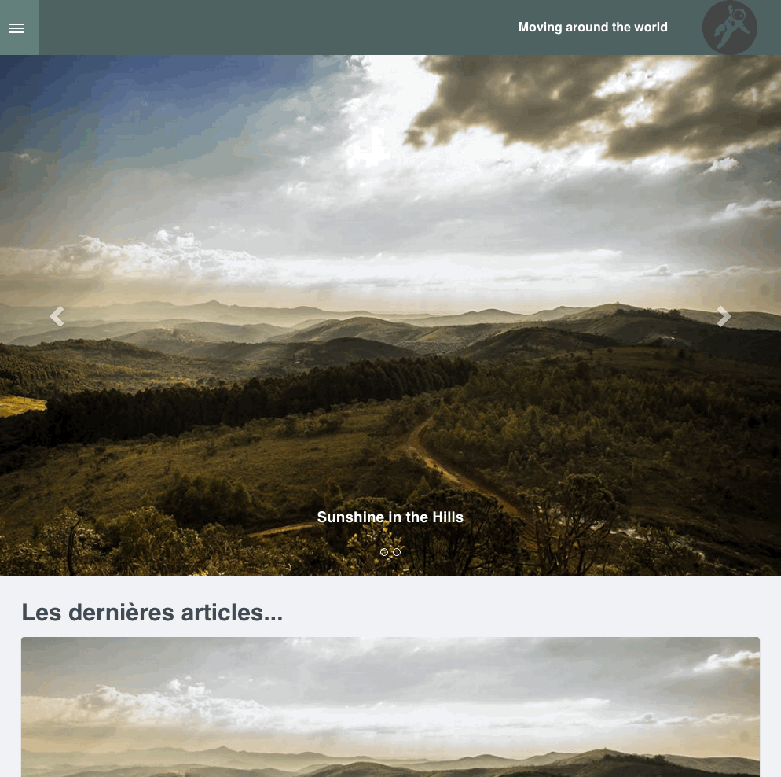

# Bootflat

Materialize is a [Grav](http://github.com/getgrav/grav) theme that is based on the [Bootflat framework](http://bootflat.github.io/).

# Preview



More [here](https://github.com/getgrav/grav-theme-antimatter/tree/master/assets)

# Installation

Get the lastest zip version and unzip in theme folder of your grav installation.

# Usage

## Caroussel

**Requirements** : plugin taxonomy.

Caroussel use the tag `highlight` in order to display slide.

You have to tag your post with `highlight` and have an image in post folder in order to have a valid slide.
Make sure to have equal ratio between the image of your posts selected for the caroussel.

If you have multiple images, the first image is display in the caroussel.

### Number of slides
By default, the number of slides is limited to five. If you want to change this value, add in `user/config/themes/bootflat.yaml` the following directives :
```yaml
slider:
  limit: 2
```

[Link](http://learn.getgrav.org/themes/theme-configuration) to getgrav documentation about theme configuration

# Inspiration

  * Menu https://codyhouse.co/gem/secondary-expandable-navigation/
